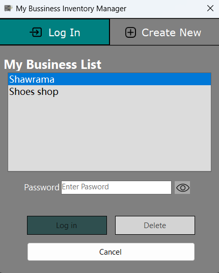
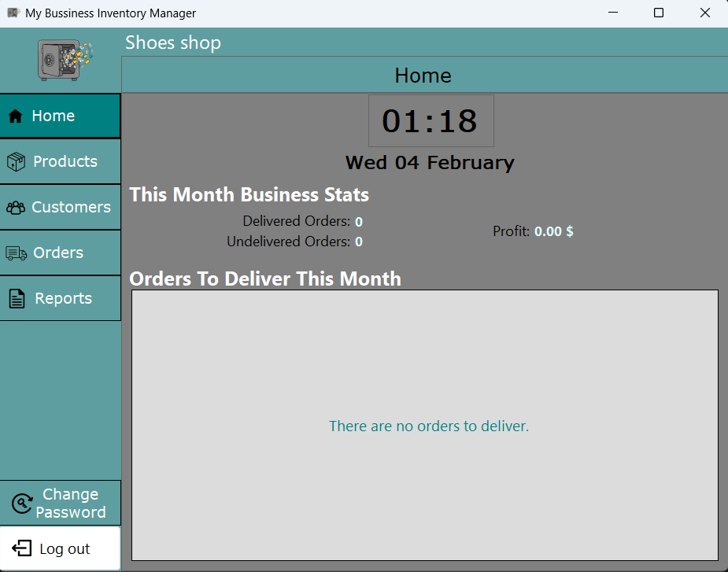

# Business Inventory Management System

This project is a **C# Windows Forms desktop application** created to manage products and inventory for a small business.

The application provides a simple and clear interface to add, edit, delete, and view inventory items.  
The focus of this project is practical use of C#, basic business logic, and clean project structure.
  
It is designed to help small businesses manage their daily inventory operations in a simple and organized way.

The application provides features for managing **products**, **customers**, and **orders**, allowing users to keep track of inventory quantities and business records.  
It also includes basic **reporting** functionality to help view and review stored data in a clear format.

The focus of the application is ease of use, clean interface design, and practical implementation of core C# and WinForms concepts in a real business-oriented scenario.

> **Note:**  
> The application was designed and implemented based on my own business rules and assumptions.  
> The structure, logic, and workflow reflect personal design decisions made for learning and practical purposes.

------

## Download Application

1. Go to the **Releases** section of this repository.
2. Open the latest release (Version 1.0).
3. Download the ZIP file attached to the release.
4. Extract the ZIP file to any folder on your computer.

------

## How to Run the Application

1. Open the extracted folder.
2. Double-click the `.exe` file to start the application.

### .NET Runtime Requirement
If the application does not start, you may need to install the **.NET Desktop Runtime**.

You can download it from Microsoft here:  
https://dotnet.microsoft.com/download/dotnet

After installing the runtime, run the application again.

---

## Windows Security Warning

When running the application for the first time, Windows may show a security warning such as  
**"Windows protected your PC"**.

This is normal for applications that are not digitally signed.

To continue:
1. Click **More info**
2. Click **Run anyway**

The application is safe to run.

---

## Source Code

This repository contains the **source code only**.  
The compiled application is provided separately in the **Releases** section.

